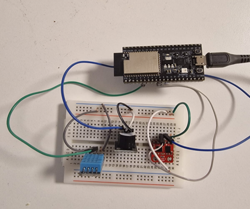
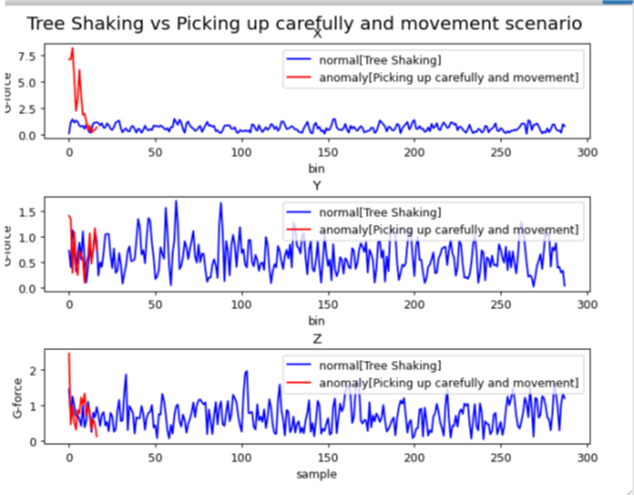
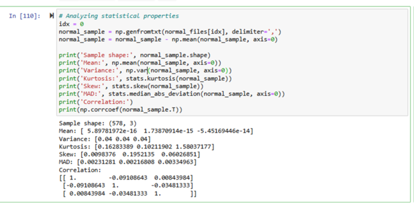
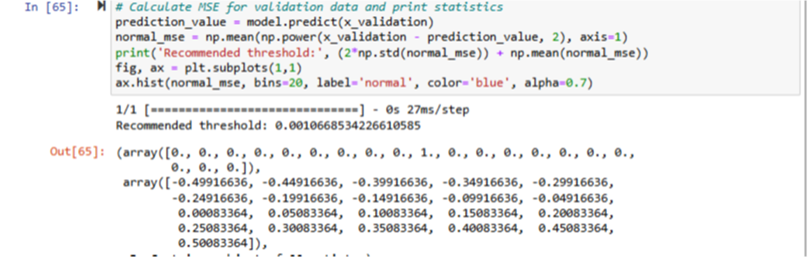
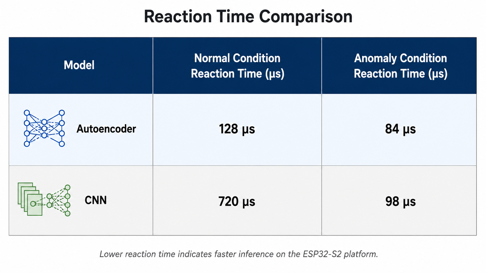

# Theft_detection-IoT_Sensor
IoT-based sensor monitoring and theft detection framework using ESP32, TinyML, and multi-sensor fusion for real-time environmental monitoring and edge anomaly detection.
# IoT Sensor Monitoring and Theft Detection Framework

> An IoT-based sensor monitoring and theft detection system developed using ESP32 and TinyML for real-time environmental monitoring and anomaly detection.

> **Note**
>
> This repository documents a Master's project developed **solely by me** at the University of Bremen.
>
> Due to academic, security, and intellectual property considerations, the original firmware, machine learning model, datasets, and project report are **not included** in this repository.
>
> This repository serves as a technical showcase of the system architecture, implementation methodology, and project outcomes.

---

# Project Overview

IoT sensors are increasingly deployed in remote environments such as agricultural fields, forests, and environmental monitoring stations. While these systems continuously collect valuable data, they are also vulnerable to theft, vandalism, and unauthorized handling.

This project presents a complete IoT framework capable of simultaneously:

- Monitoring environmental conditions
- Detecting physical tampering of deployed sensor nodes
- Performing anomaly detection directly on the edge device
- Triggering real-time alerts without requiring cloud processing

The complete system was implemented on an **ESP32-S2** microcontroller using multiple sensors and a lightweight TinyML model.

---

# Objectives

- Monitor environmental temperature and humidity
- Detect abnormal movement of the sensor node
- Detect unauthorized pickup or theft attempts
- Reduce false alarms caused by environmental motion (wind, vibrations)
- Execute anomaly detection directly on the ESP32
- Provide immediate audible alerts through a buzzer

---

# Hardware Components

| Component | Purpose |
|-----------|----------|
| ESP32-S2 | Main microcontroller |
| DHT11 | Temperature & humidity monitoring |
| ADXL345 | 3-axis accelerometer for motion detection |
| HC-SR04 | Ultrasonic distance measurement |
| Passive Piezo Buzzer | Audible alarm |
| 3.7V LiPo Battery | Portable power supply |

---

# Hardware Prototype

The prototype integrates environmental and motion sensors with the ESP32-S2 on a portable battery-powered platform.

<p align="center">

</p>

---


# Software Stack

- Arduino IDE
- ESP32 Framework
- TensorFlow Lite for Microcontrollers
- Python
- NumPy
- Pandas
- Scikit-learn
- TensorFlow / Keras

---

# System Architecture

```
                    Environmental Data
                           │
            ┌──────────────┴──────────────┐
            │                             │
        Temperature                 Motion
          DHT11                  ADXL345 IMU
            │                             │
            └──────────────┬──────────────┘
                           │
                    Ultrasonic Sensor
                      HC-SR04 Distance
                           │
                           ▼
                      ESP32-S2 MCU
                           │
          Feature Extraction (MAD Calculation)
                           │
                           ▼
             TinyML Autoencoder Inference
                           │
              Reconstruction Error (MSE)
                           │
          MSE Threshold + Distance Threshold
                           │
          ┌────────────────┴───────────────┐
          │                                │
      Normal State                  Anomaly Detected
          │                                │
     Continue Monitoring          Activate Buzzer Alarm
```

---

# Machine Learning Pipeline

Unlike conventional threshold-only systems, this project integrates a lightweight machine learning model for anomaly detection.

The overall pipeline consists of:

1. Collect raw accelerometer data
2. Collect ultrasonic distance measurements
3. Extract statistical features
4. Compute Median Absolute Deviation (MAD)
5. Feed extracted features into an Autoencoder
6. Compute reconstruction error (MSE)
7. Compare MSE against the learned threshold
8. Combine MSE result with ultrasonic distance threshold
9. Trigger the alarm if both conditions indicate suspicious activity

---

# Autoencoder-Based Anomaly Detection

The system was trained only on **normal operating conditions**.

Examples include:

- Tree movement due to wind
- Small environmental vibrations
- Natural movement of the mounting surface

During deployment:

- Normal motion produces a **low reconstruction error**
- Theft attempts generate a **high reconstruction error**

The Mean Squared Error (MSE) is used as the anomaly score.

If:

```
MSE > Learned Threshold
```

and

```
Distance < Distance Threshold
```

the system classifies the event as a theft attempt and activates the buzzer.

---

# Simplified Detection Algorithm

```text
Initialize sensors

Initialize TinyML model

Load thresholds

Loop forever

    Read temperature

    Read humidity

    Read accelerometer values

    Read ultrasonic distance

    Extract statistical features

    Calculate MAD

    Perform Autoencoder inference

    Compute reconstruction error

    If (MSE > threshold) AND (distance < threshold)

         Trigger buzzer

    Else

         Continue monitoring

End Loop
```

---

# Experimental Evaluation

The prototype was evaluated under multiple real-world scenarios, including:

- Tree shaking due to wind
- Manual shaking
- Careful pickup and movement
- Rapid detachment
- Forceful removal
- Accidental fall
- Casual handling
- Device throwing
- Device relocation
- Normal environmental operation

The proposed approach successfully differentiated natural environmental movement from actual theft attempts while minimizing false alarms.

---
# Experimental Results

## Normal vs. Anomalous Motion

The following figure compares normal environmental movement with suspicious device handling using accelerometer measurements.

<p align="center">

</p>

---

## Feature Engineering

Median Absolute Deviation (MAD) was selected as the primary statistical feature because of its robustness to noise and outliers.

<p align="center">

</p>

---

## Threshold Selection

The Autoencoder reconstruction error (MSE) was analyzed to determine the optimal anomaly detection threshold.

<p align="center">

</p>

---

## Performance Comparison

A lightweight Autoencoder was compared against a CNN-based approach on the ESP32 platform.

<p align="center">

</p>

The Autoencoder achieved significantly lower inference latency while maintaining reliable anomaly detection, making it better suited for deployment on resource-constrained embedded devices.

---

# Skills Demonstrated

### Embedded Systems

- ESP32 Programming
- Sensor Integration
- GPIO
- I2C Communication
- Embedded C/C++

### Machine Learning

- TinyML
- Autoencoder
- TensorFlow Lite
- Feature Engineering
- Anomaly Detection

### IoT

- Wireless Sensor Networks
- Edge Computing
- Environmental Monitoring
- Remote Sensor Deployment

### Data Analysis

- Python
- NumPy
- Pandas
- Statistical Feature Extraction
- Threshold Optimization

---

# Repository Contents

This repository intentionally includes:

- Project overview
- System architecture
- Hardware description
- ML pipeline
- Detection workflow
- Pseudocode
- Experimental summary

The following are intentionally **not included**:

- Firmware source code
- TensorFlow model
- TensorFlow Lite model
- Training dataset
- Raw experimental data
- Full academic report

---

# Future Improvements

- LoRaWAN connectivity for long-range communication
- Mobile application for remote alerts
- Cloud dashboard integration
- OTA firmware updates
- Solar-powered deployment
- GPS-based theft tracking
- Camera-assisted verification
- Multi-node sensor network

---

# Disclaimer

This repository is intended solely as a technical portfolio showcasing the design and implementation of the project.

The original firmware, datasets, machine learning models, and academic report remain private and are therefore not distributed through this repository.
